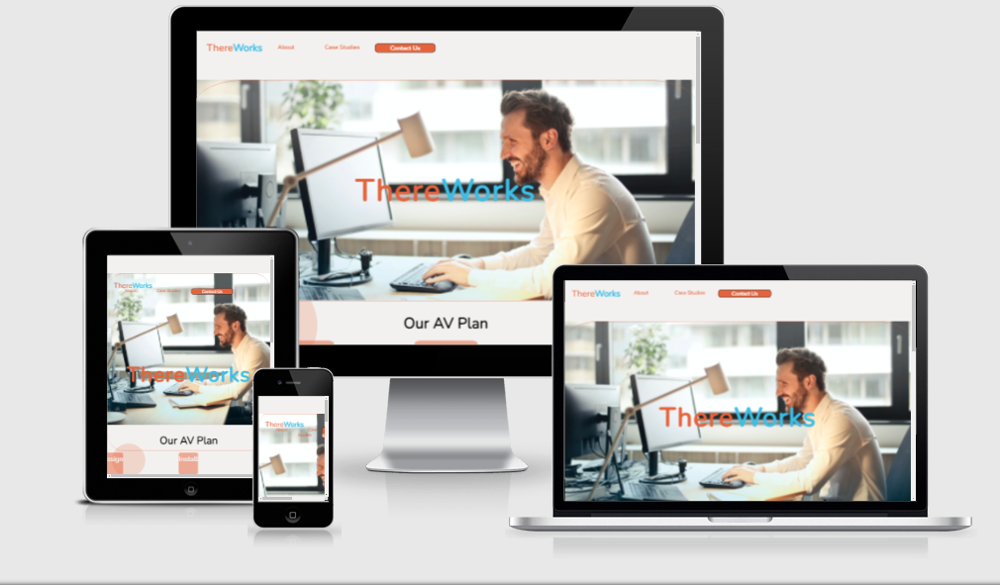

Thereworks
Thereworks is a Audio Visaual company.  
They provide design, install and service to coparate companies throughout Ireland. 
Users of this website will get to find information about Thereworks and what they can offer them.
 
Features  
* Navigation
    * Featured at the the top left of the page is the company logo, this also brings the user back to the homepage(or refreshes the page) when clicked. It also scales up when hovered over
    * The other navigation links are to the right: About, Case Studies and Contact Us
    * The navigation clearly tells the user the name of the company and makes the different sections fo information easy to find 
 

* The Header
    * The header shows the name of the company and a hero Image
 

* The Diagram Section
    * The diagram section shows the user what the company does
    * When a tile is hovered over a drop down box appears giving some additional information to the user
    * The color of the tile also changes when hovered over.
    * There are some colored cirlces in the background for aesthetics
     
     

* The Topic Section
    * The Topic section gives the user information on the the services Thereworks provides
    * It has a background image of a meeting room with the text above it
     

* The Events Section
    * Shows the user where and when the next upcoming event is
     

* The Footer
    * Featured at the bottom of all the pages, the footer shows the logo, address, contact details and links to Thereworks' social media accounts
    * Clicking on the Thereworks logo will bring you back to the top of the homepage.
     
    

